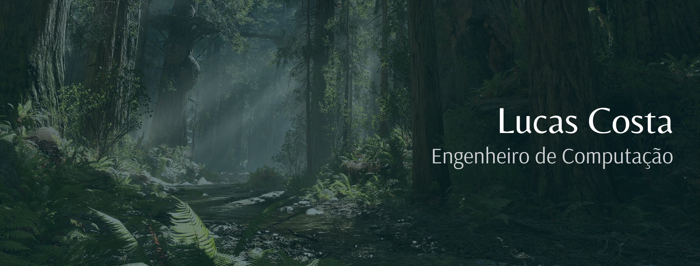

# Bem-vindo!

Este é o repositório de Lucas Costa, quem vos fala e escreve.

Sou Engenheiro de Computação por graduação, desenvolvedor e programador por profissão, cientísta por sonho e músico por amor.

## Nome de usuário

Embora me chame "Lucas Costa", levo por apelido o nome "Evaristo" desde o período da graduação, por motivos que, na verdade, nem eu sei. Fato é: o apelido é tão forte que muitos dos meus conhecidos provavelmente nem lembram do verdadeiro. Por isso e outros motivos, o nome deste ficou como "evaristocosta".

## Tecnologias

## Onde me encontrar

## Os dados

   